# 🏗️ Architecture Documentation

## 1. High-Level Data Flow

The application follows a **Client-Server-Client** broadcast model using WebSockets.

```mermaid
sequenceDiagram
    participant UserA as 🎨 Client A
    participant Server as 🖥️ Node Server
    participant UserB as 👀 Client B

    Note over UserA: User draws a stroke
    UserA->>UserA: 1. Draw to local Canvas (Immediate Feedback)
    UserA->>Server: 2. Emit 'draw_line' {points, color, width}
    Server->>Server: 3. Add to In-Memory History
    Server->>UserB: 4. Broadcast 'draw_line'
    UserB->>UserB: 5. Render stroke on Canvas
```

## 2. WebSocket Protocol (Socket.io)

We define a minimal set of events to keep overhead low.

| Event Name | Direction | Payload | Description |
| :--- | :--- | :--- | :--- |
| `join_room` | Client → Server | `{ name, color }` | User identifying themselves. |
| `load_canvas` | Server → Client | `Array<Line>` | Sent to a new user immediately upon connection. Contains full history. |
| `draw_line` | Bidirectional | `{ points: [{x,y}...], color, width }` | A completed stroke or chunk of points. `broadcast` to others. |
| `undo` | Client → Server | `null` | Request to undo the last action. |
| `redo` | Client → Server | `null` | Request to redo the last undone action. |
| `redraw_canvas` | Server → Client | `Array<Line>` | Sent after an Undo/Redo/Clear to force clients to repaint the whole state. |
| `update_users` | Server → Client | `Array<User>` | List of currently connected users for the UI counter. |

## 3. Undo/Redo Strategy (Global State)

Unlike local-only drawing apps, **Undo/Redo must be global** in a collaborative setting to maintain a "Single Source of Truth."

*   **The Problem**: If User A undos, should it remove *their* last line, or the *global* last line?
*   **Our Decision**: **Global History Stack**.
    *   The server maintains a main `lineHistory` array and a `redoStack` array.
    *   **Undo**: Pops the last item from `lineHistory` and pushes it to `redoStack`. Triggers a `redraw_canvas` event to ALL users.
    *   **Redo**: Checks `redoStack`, pops, pushes back to `lineHistory`. Triggers `redraw_canvas`.
    *   **New Draw**: If a new line is drawn, the `redoStack` is **cleared** (standard behavior to avoid branching history).

## 4. Conflict Resolution & Concurrency

*   **Strategy**: **Last-Write-Wins (LWW)** / **Naive Broadcast**.
*   **Rationale**: For a creative drawing app, strict transactional integrity (locking the canvas) destroys the user experience.
*   We allow all users to emit points simultaneously.
*   The server simply appends them to the history in the order they arrive.
*   Since the Canvas API is raster-based, overlapping lines just "paint over" each other, naturally resolving conflicts without complex CRDTs (Conflict-free Replicated Data Types), which would be overkill for this scope.

## 5. Performance Decisions

### In-Memory Storage
We chose **JS Map** and **Arrays** in Node.js memory instead of a database (MongoDB).
*   **Pros**: Extremely fast read/write (Microsecond latency). No DB bottleneck for high-frequency drawing events.
*   **Cons**: Volatile (Server restart = Data loss).

### Batching vs. Streaming
*   We emit `draw_line` generally on `mouseup` (stroke completion) or in larger chunks, rather than emitting every single `mousemove` pixel.
*   **Benefit**: drastically reduces network packet overhead.
*   **Client-Side Smoothing**: We use **Quadratic Curve** interpolation (`ctx.quadraticCurveTo`) on the client. This allows us to send fewer coordinate points over the network while still rendering smooth, round curves locally.
